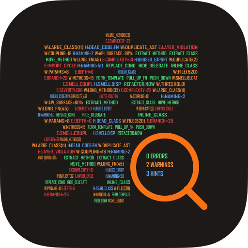

# Cha

<p align="center">
  
</p>

<p align="center">
  <strong>察 — Code Health Analyzer</strong>
</p>

<p align="center">
  <a href="https://github.com/W-Mai/Cha/actions">
    
  </a>
  <a href="https://github.com/W-Mai/Cha/blob/main/LICENSE">
    
  </a>
  <a href="https://github.com/W-Mai/Cha">
    
  </a>
  <a href="https://github.com/W-Mai/Cha/releases">
    
  </a>
</p>

**Cha** (察, "to examine") is a pluggable code smell detection toolkit. It parses source code at the AST level, runs architectural health checks, and reports findings as terminal output, JSON, LLM context, or SARIF.

## ⚡ Quick Start

```bash
# Analyze current directory (recursive, .gitignore aware)
cha analyze

# Analyze specific path with JSON output
cha analyze src/ --format json --fail-on error

# Only analyze changed files (git diff)
cha analyze --diff

# Analyze changes from piped diff (e.g. PR review)
gh pr diff | cha analyze --stdin-diff --fail-on warning

# Run specific plugins only
cha analyze --plugin complexity,naming

# Force full re-analysis (skip cache)
cha analyze --no-cache

# Generate baseline of current issues
cha baseline

# Only report new issues (not in baseline)
cha analyze --baseline .cha/baseline.json

# Generate HTML report
cha analyze --format html --output report.html

# Parse and inspect file structure
cha parse src/

# Generate default config
cha init

# Print JSON Schema for output format
cha schema

# Auto-fix naming convention violations
cha fix src/ --dry-run

# Scaffold a new WASM plugin
cha plugin new my-plugin

# Build plugin and convert to WASM component
cha plugin build

# Install plugin
cha plugin install my_plugin.wasm

# List installed plugins
cha plugin list

# Remove a plugin
cha plugin remove my_plugin

# Generate shell completions (fish/bash/zsh/powershell)
cha completions fish > ~/.config/fish/completions/cha.fish

# Show import dependency graph (DOT/JSON/Mermaid)
cha deps --format dot
cha deps --format mermaid --depth dir

# Show class hierarchy
cha deps --type classes --format dot
cha deps --type classes --filter Plugin --format mermaid
```

## 📦 Installation

```bash
git clone https://github.com/W-Mai/Cha.git
cd Cha
cargo build --release
```

Binaries `cha` and `cha-lsp` will be in `target/release/`.

Requires [Rust](https://www.rust-lang.org/tools/install) (edition 2024).

## 🔍 Built-in Plugins

| Plugin | Detects | Category | Severity |
|--------|---------|----------|----------|
| **LengthAnalyzer** | Long methods (>50 lines), large classes, large files | Bloaters | Warning |
| **ComplexityAnalyzer** | High cyclomatic complexity | Bloaters | Warning/Error |
| **DuplicateCodeAnalyzer** | Structural duplication via AST hash (>10 lines) | Dispensables | Warning |
| **CouplingAnalyzer** | Excessive imports / dependencies | Couplers | Warning |
| **NamingAnalyzer** | Too-short names, convention violations | Bloaters | Hint/Warning |
| **DeadCodeAnalyzer** | Unexported / unreferenced code | Dispensables | Hint |
| **ApiSurfaceAnalyzer** | Over-exposed public API (>80% exported) | Couplers | Warning |
| **LayerViolationAnalyzer** | Cross-layer dependency violations | Change Preventers | Error |
| **LongParameterListAnalyzer** | Functions with >5 parameters | Bloaters | Warning |
| **SwitchStatementAnalyzer** | Excessive switch/match arms (>8) | OO Abusers | Warning |
| **MessageChainAnalyzer** | Deep field access chains (a.b.c.d) | Couplers | Warning |
| **PrimitiveObsessionAnalyzer** | Functions with mostly primitive parameter types | Bloaters | Hint |
| **DataClumpsAnalyzer** | Repeated parameter type signatures across functions | Bloaters | Hint |
| **FeatureEnvyAnalyzer** | Methods that reference external objects more than their own | Couplers | Hint |
| **MiddleManAnalyzer** | Classes where most methods only delegate | Couplers | Hint |
| **CommentsAnalyzer** | Functions with >30% comment lines | Dispensables | Hint |
| **LazyClassAnalyzer** | Classes with ≤1 method and very few lines | Dispensables | Hint |
| **DataClassAnalyzer** | Classes with only fields and accessors, no behavior | Dispensables | Hint |
| **TemporaryFieldAnalyzer** | Fields used in only a few methods | OO Abusers | Hint |
| **SpeculativeGeneralityAnalyzer** | Interfaces/traits with ≤1 implementation | Dispensables | Hint |
| **RefusedBequestAnalyzer** | Subclasses that override most parent methods | OO Abusers | Hint |
| **ShotgunSurgeryAnalyzer** | Files that always change together (git log) | Change Preventers | Hint |
| **DivergentChangeAnalyzer** | Files changed for many distinct reasons (git log) | Change Preventers | Hint |
| **InappropriateIntimacyAnalyzer** | Bidirectional imports between files | Couplers | Warning |
| **DesignPatternAdvisor** | Suggests Strategy, State, Builder, Null Object, Template Method, Observer | OO Abusers | Hint |
| **HardcodedSecretAnalyzer** | API keys, tokens, passwords, private keys, JWTs in source code | Security | Warning |

Supported languages: Python (.py), TypeScript (.ts/.tsx), Rust (.rs), Go (.go), C (.c/.h), C++ (.cpp/.cc/.cxx/.hpp/.hxx).

## ⚙️ Configuration

Create `.cha.toml` in your project root:

```toml
# Exclude paths from analysis (glob patterns)
exclude = ["*/tests/fixtures/*", "vendor/*"]

[plugins.length]
enabled = true
max_function_lines = 30
max_class_lines = 200

[plugins.complexity]
warn_threshold = 10
error_threshold = 20

[plugins.coupling]
max_imports = 15

[plugins.layer_violation]
enabled = true
layers = "domain:0,service:1,controller:2"

# Custom tech debt estimation weights (minutes per severity)
[debt_weights]
hint = 5
warning = 15
error = 30
```

All plugins are enabled by default. Set `enabled = false` to disable.

## 🧩 WASM Plugins

Extend with custom analyzers via WebAssembly Component Model:

```bash
cd examples/wasm-plugin-example
cha plugin build
cha plugin install example.wasm
```

Place `.wasm` files in `.cha/plugins/` (project-local) or `~/.cha/plugins/` (global).

Configure plugin options in `.cha.toml`:

```toml
[plugins.hardcoded-strings]
SITE_DOMAIN = "example.com"
USER_NAME   = "octocat"
```

### Writing a plugin

Add to your plugin's `Cargo.toml`:

```toml
[lib]
crate-type = ["cdylib"]

[dependencies]
cha-plugin-sdk = { git = "https://github.com/W-Mai/Cha" }
wit-bindgen = "0.55"
```

Then in `src/lib.rs` — no WIT file needed, the SDK embeds it:

```rust
cha_plugin_sdk::plugin!(MyPlugin);

struct MyPlugin;

impl Guest for MyPlugin {
    fn name() -> String { "my-plugin".into() }
    fn analyze(input: AnalysisInput) -> Vec<Finding> { vec![] }
}
```

See `examples/wasm-plugin-example` (suspicious names) and `examples/wasm-plugin-hardcoded` (hardcoded strings) for complete examples.

📖 **[Full Plugin Development Guide](docs/plugin-development.md)**

## 💡 LSP Integration

```bash
cha-lsp
```

Provides diagnostics on open/change/save and code action suggestions.

## 🛠️ Development

```bash
# Run all CI checks locally
cargo xtask ci

# Individual steps
cargo xtask build     # Release build
cargo xtask test      # Unit + property + fixture tests
cargo xtask lint      # Clippy + fmt
cargo xtask analyze   # Self-analysis in all formats
cargo xtask lsp-test  # LSP smoke test

# Release (push → wait CI → tag → wait release workflow → publish to crates.io)
cargo xtask release
```

## 📁 Project Structure

```
cha-core/       Core traits, plugin registry, reporters, WASM runtime
cha-parser/     Tree-sitter parsing (Python, TypeScript, Rust, Go, C, C++)
cha-cli/        CLI binary (analyze, parse)
cha-lsp/        LSP server binary
xtask/          CI automation (cargo xtask)
wit/            WIT interface for WASM plugins
examples/       Example WASM plugin
static/         Logo and assets
```

## 📄 License

MIT License.
