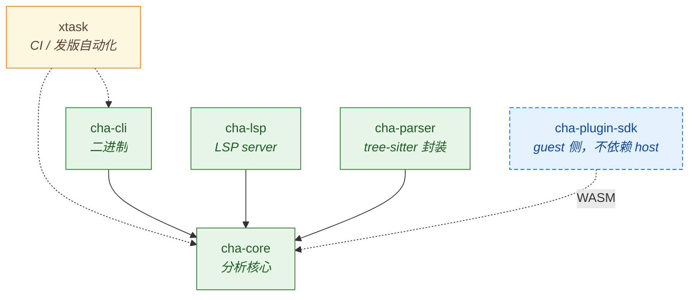
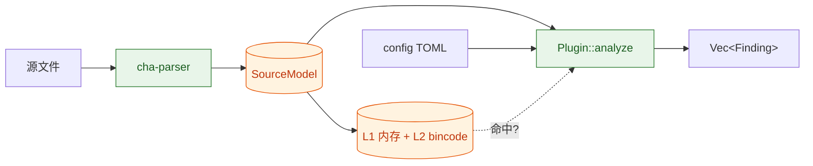

# 架构

cha 是一个 Rust workspace，一共七个 crate。依赖方向写死了：`cha-core` 不依赖 `cha-parser`（它只通过 [`cha-core/src/plugin.rs`](https://github.com/W-Mai/Cha/blob/main/cha-core/src/plugin.rs) 里的 trait 间接接触 `cha-parser` 的产物），`cha-cli` 依赖 `cha-core`，`cha-plugin-sdk` 谁都不依赖。这个方向不能反。

## Crate 关系



| Crate | 位置 | 职责 |
|---|---|---|
| `cha-core` | [`cha-core/`](https://github.com/W-Mai/Cha/tree/main/cha-core) | `Plugin` trait、`Finding` / `SourceModel` / `SymbolIndex` 数据模型、registry、reporter（terminal / JSON / SARIF / HTML / LLM）、WASM runtime、两层缓存。 |
| `cha-parser` | [`cha-parser/`](https://github.com/W-Mai/Cha/tree/main/cha-parser) | Python、TypeScript / TSX、Rust、Go、C、C++ 的 tree-sitter parser。产出 `SourceModel` 和 `SymbolIndex`。 |
| `cha-cli` | [`cha-cli/`](https://github.com/W-Mai/Cha/tree/main/cha-cli) | CLI 二进制。子命令在 [命令行参考](../cli/index.md) 全列出来了。 |
| `cha-lsp` | [`cha-lsp/`](https://github.com/W-Mai/Cha/tree/main/cha-lsp) | LSP server 库 + 入口。诊断、code action、code lens、hover、inlay hint、semantic token、workspace diagnostics。 |
| `cha-plugin-sdk` | [`cha-plugin-sdk/`](https://github.com/W-Mai/Cha/tree/main/cha-plugin-sdk) | Guest 侧库 + `plugin!` 宏。编译目标 `wasm32-wasip2`。不依赖 `cha-core`。 |
| `xtask` | [`xtask/`](https://github.com/W-Mai/Cha/tree/main/xtask) | `cargo xtask` 自动化：`ci`、`test`、`lint`、`analyze`、`bump`、`release`、`publish`、`docgen-cli`、`docs-check`、`i18n-check`。 |
| `vscode-cha` | [`vscode-cha/`](https://github.com/W-Mai/Cha/tree/main/vscode-cha) | VS Code 扩展。第一次启动时自动下载匹配版本的 `cha` 二进制。 |

## 数据流



`SourceModel` 是统一的中间格式。每个插件拿到的都是同一份 `&AnalysisContext { file, model, config }`。每个文件只解析一次，结果按缓存 key 哈希后在所有插件间共享。

WASM 插件多一跳：`cha-core::wasm` 里的 host adapter 把 `AnalysisInput`（`AnalysisContext` 的一个子集——只保留能跨 WASM 边界传递的字段，定义在 [`wit/cha-plugin.wit`](https://github.com/W-Mai/Cha/blob/main/wit/cha-plugin.wit) 里）序列化送过去；guest 侧的 [`cha-plugin-sdk`](https://github.com/W-Mai/Cha/tree/main/cha-plugin-sdk) 把它反序列化成 Rust 类型给插件用。

## `Plugin` trait

内置检测器实现 [`cha_core::Plugin`](https://github.com/W-Mai/Cha/blob/main/cha-core/src/plugin.rs)：

```rust
pub trait Plugin: Send + Sync {
    fn name(&self) -> &str;
    fn smells(&self) -> Vec<String>;
    fn description(&self) -> &str;
    fn analyze(&self, ctx: &AnalysisContext) -> Vec<Finding>;
}
```

WASM 插件实现 [`cha_plugin_sdk::PluginImpl`](https://github.com/W-Mai/Cha/blob/main/cha-plugin-sdk/src/lib.rs) —— 跟 `Plugin` 形状对应的另一个 trait，只是返回 `String` 不返回 `&str`（WIT 不支持借用类型）。`cha-core::wasm` 的 host bridge 让 `PluginImpl` 实现可以跟原生 Plugin 一起进同一个 registry。

## 缓存

两层，都在 `cha-core::cache` 里：

- **L1**：进程内的 `DashMap<PathBuf, CachedResult>`。生命周期 = 一次 `cha analyze`。
- **L2**：`.cha/cache/` 下的 bincode 文件。缓存 key 是 `(文件 mtime, 文件大小, 插件集合 hash, config hash)`。mtime 没变就直接跳过解析。

插件集合 hash 包含已安装的 `.wasm` 文件 —— 装新插件 / 重装插件会自动作废这个插件碰过的缓存。

## 想扩什么动哪里

| 想做的事 | 改哪里 |
|---|---|
| 加一条内置 smell | `cha-core/src/plugins/` 加文件 + 在 `cha-core/src/registry.rs` 注册 |
| 支持新语言 | `cha-parser/src/<lang>.rs` + 在 `cha-parser/src/lib.rs` 里映射 |
| 加一条 CLI 子命令 | `cha-cli/src/<subcommand>.rs` + 在 `cha-cli/src/main.rs` 里接进来 |
| 给 WASM 插件暴露新能力 | 改 [`wit/cha-plugin.wit`](https://github.com/W-Mai/Cha/blob/main/wit/cha-plugin.wit)、重生成 binding、在 `cha-core/src/wasm.rs` 里实现 host adapter、再在 `cha-plugin-sdk/src/lib.rs` 里暴露 |
| 加 LSP 能力 | `cha-lsp/src/lib.rs` |

## See also

- [写一条 smell](./writing-a-smell.md)
- [插件开发](../plugins/development.md)（host 侧 trait + WASM SDK）
- [`Plugin`](https://github.com/W-Mai/Cha/blob/main/cha-core/src/plugin.rs) 和 [`PluginImpl`](https://github.com/W-Mai/Cha/blob/main/cha-plugin-sdk/src/lib.rs) 源码
